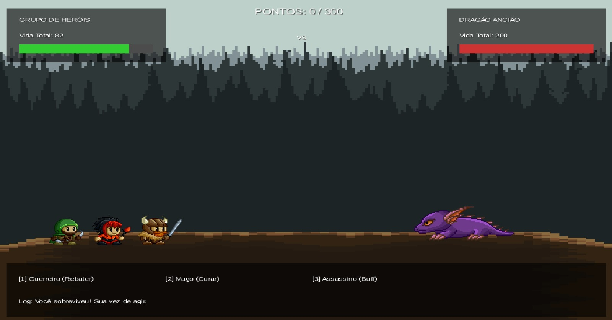

## Trabalho Final de Paradigmas

## Identificação
Nome: Deivid Da Silva Trindade

Curso: Sistemas de Informação

Proposta:

Seria basicamente um RPG por turno, onde dá para criar uma equipe que enfrentará outra equipe em uma batalha. As batalhas serão escolhidas no menu do jogo, onde poderá ter desafios ou algo do tipo. Vai ter diferentes personagens, com habilidades/poderes, um sistema de pontuação e algumas mecânicas de combate.

## Fundamentos de Orientação a Objetos Utilizados

Durante o desenvolvimento, apliquei os conceitos fundamentais do paradigma para garantir um código bem estruturado e funcional:

Encapsulamento: Todos os atributos (como vida e ataque) são privados na classe Personagem. O acesso é feito apenas via métodos públicos, garantindo que a lógica de dano e cura seja executada de forma controlada.

Composição: A classe Main gerencia o estado do jogo através da composição de objetos Personagem. Isso permitiu que o sistema de "Ondas" funcionasse de forma fluida: ao derrotar um inimigo, basta instanciar um novo objeto, reaproveitando a lógica de batalha já consolidada.

Abstração: O jogo trata as diferentes entidades (Guerreiro, Mago, Dragão) através de uma estrutura comum, simplificando a lógica de colisão e atualização de estados dentro do loop principal (render).

## Processo de Desenvolvimento

## 01/06/2026

Comecei o projeto no dia 1 de junho e, neste dia, acabei adicionando apenas o devcontainer.

---

## 08/06/2026

Consegui retomar ele no dia 8. Antes de começar o jogo, dei uma olhada em alguns dos exemplos que a professora Andrea disponibilizou na disciplina para ter uma ideia de como os projetos funcionavam.

Depois disso, criei os dois primeiros arquivos do projeto, o `Main.java` e o `Personagem.java`.

No `Personagem.java` comecei adicionando o nome e a vida do personagem. Depois adicionei também o ataque.

No `Main.java` criei o primeiro personagem para testar se estava funcionando e mostrar as informações dele na tela.

Por enquanto estou fazendo as coisas aos poucos para entender melhor a lógica do jogo antes de começar a parte das batalhas, habilidades e pontuação.

---

## 10/06/2026

Continuei um pouco do projeto 

Coloquei o sistema de dano nos personagens, para permitir que a vida seja reduzida durante a batalha, e testei se a vida estava sendo atualizada corretamente

## 13/06/2026

Acabei mexendo no sistema de ataque entre personagens utilizando o sistema de dano que já havia criado anteriormente.

Por fim, comecei a adicionar e configurar a LibGDX no projeto para estudar como será feita a parte gráfica do jogo e a publicação na web.

Também adicionei, a estrutura de pastas, criando os models e a pasta de entidade, e o script do inimigo.

## 14/06/2026

Consegui criar a primeira tela do jogo utilizando a `LibGDX`.

Fiz tambem nessa primeira versão a tela que mostra o nome do jogo e informações básicas do Guerreiro e do Orc.

Também realizei testes para verificar se a aplicação estava executando corretamente.

Gerei a versão web do projeto utilizando a LibGDX e realizei a publicação inicial no itch.io para a primeira entrega inicial do projeto.

## 20/06/2026

Continuei o desenvolvimento da interface gráfica utilizando LibGDX.

Adicionei um fundo ao cenário para melhorar a apresentação visual do jogo e implementei um sistema básico de interação por teclado, permitindo que o jogador realize ataques utilizando a tecla 1.

Também foi criado um sistema de mensagens na tela para exibir o resultado das ações realizadas durante o combate, atualizando dinamicamente a vida do inimigo.

Durante esta etapa utilizei ferramentas de IA como apoio para estudar recursos da LibGDX, testar alternativas de interface e acelerar a prototipação da tela inicial, mantendo a implementação e adaptação do código de acordo com a necessidade.

## 22/06/2026

Hoje consegui fechar a lógica principal do combate e dar uma ajeitada na tela.

Como as letras estavam difíceis de ler por causa do fundo da floresta, coloquei umas caixas horizontais para ficar melhor de ver os textos e fiz umas barrinhas de vida de texto 'Provisório' pra ficar melhor de visualizar.

Na parte do código, terminei o loop dos turnos: agora quando o guerreiro ataca ou usa a nova opção de curar, o Orc já ataca de volta automaticamente. Também adicionei a verificação de fim de jogo (mostrando vitória ou derrota) e a opção de apertar 'R' para reiniciar a partida sem precisar fechar a janela.

Acabei tendo que aumentar o tamanho da janela padrão do LibGDX também, porque a tela original estava cortando as informações.

## 23/06/2026

Hoje foquei em melhorar o visual do jogo. Troquei o fundo por um cenário de floresta em camadas para dar profundidade e adicionei os sprites em pixel art. Tive que usar uma função da própria LibGDX para espelhar a textura do Orc e ele não ficar de costas.

Como os painéis de texto estavam cobrindo o cenário, reduzi o tamanho deles: coloquei as informações de vida no topo e os botões de ação numa barra no rodapé.

Na parte do código, implementei os cliques do mouse criando um método para calcular a área de contato na tela. Agora dá para jogar tanto pelo teclado quanto clicando. Por fim, criei uma animação de ataque simples manipulando o eixo X no loop de renderização, fazendo o personagem dar uma investida e voltar para a posição inicial.

## 24/06/2026

Hoje foi o dia de finalizar as mecânicas e polir o jogo para a entrega:

Sistemas de Combate: Implementei o sistema de "Rebote", onde o jogador usa a espada para devolver a bola de fogo do dragão. O ataque do Guerreiro agora lança um projétil contra o inimigo.

Ajustes de Balanceamento: Transformei o Buff do Assassino em uma "Ação Livre".

Sistema de Ondas: Finalizei a mecânica de progressão. Ao derrotar um Dragão, o jogo cura o grupo e um novo Dragão aparece. A dificuldade aumenta e cada novo inimigo ganha uma cor aleatória.

Condição de Vitória: Adicionei uma meta de 300 pontos. O jogo verifica a pontuação a cada ataque, e ao atingir o objetivo, ele encerra a partida com a mensagem de "Vitória Suprema".

Polimento Visual: Ajustei o tamanho e a posição dos sprites, melhorei a velocidade dos projéteis e adicionei um delay de 4 segundos entre as ondas para facilitar a leitura.

Feedback Visual: Implementei mudanças de cor (batch.setColor) para indicar cura (verde), buff (vermelho) e derrota do dragão.

---

## Diagrama de Classes

*(Diagrama gerado com Mermaid Live Editor)*

---

Orientações para Execução
Pré-requisitos: Certifique-se de ter o JDK 17 ou superior instalado.

Como rodar:

Clone o repositório.

No terminal, dentro da pasta do projeto, execute o comando: ./gradlew desktop:run (no Windows, use gradlew.bat desktop:run).

---

Resultado Final

---

Referências e Créditos
Assets: Sprites utilizados sob licença do portal itch.io.

Documentação: Documentação oficial do framework LibGDX.

IA: Utilizada como auxílio no estudo de sintaxe da LibGDX, e para a parte gráfica do libGDX, foi onde eu mais usei, pois a minha lógica é bem simples, o mais dificil foi fazer o jogo ficar bonito 